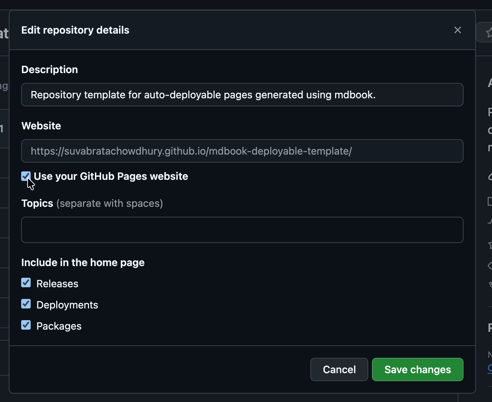

# Setup
To start writing and deploying your book‑site, you only need a few configurations. If you can create a GitHub repository and run a simple script, you’re good to go.

## Repository setup
To use the infrastructure, follow these steps:
1. Create a new repository from the [this template](https://github.com/SuvabrataChowdhury/mdbook-deployable-template).
    - **Helpful doc**: [Creating a repository from a template](https://docs.github.com/en/repositories/creating-and-managing-repositories/creating-a-repository-from-a-template).
2. Enable GitHub Pages for the new repository.
    - In your new repo, go to **Settings → Pages**.
    - Set the **publishing source** to **GitHub Actions** (you don’t need to touch branches like gh‑pages yourself).
    - **Helpful doc**: [Publishing with a custom GitHub Actions workflow](https://docs.github.com/en/pages/getting-started-with-github-pages/configuring-a-publishing-source-for-your-github-pages-site#publishing-with-a-custom-github-actions-workflow).

3. After this, the GitHub‑Actions workflow will automatically build your book and deploy it whenever you push changes to `main`.
4. Optionally, edit the description of the repository to always have easier access to the deployed page's url. 
    - In your new repo, go to **About → Settings → Tick `Use your GitHub Pages website` → `Save Changes`**


## Local environment
Before publishing online, you should write your content and test the site locally. You only need to do this once per machine.
1. Install the [mdbook](https://rust-lang.github.io/mdBook/guide/installation.html) CLI.
    - On most systems this is just a single command (e.g., via cargo or a platform‑specific package manager).
2. Ensure git is installed. If not follow this [Installation guide](https://git-scm.com/install/).
2. Clone the repository you created in the [Repository setup](#repository-setup) step:
    ```bash
    git clone https://github.com/YOUR-USERNAME/YOUR-REPO.git
    cd YOUR-REPO
    ```
3. Run the `init.sh` script to set up the local environment:
    ```bash
    ./init.sh
    ```
> **Note:** This script is not yet included in the repository. In the meantime, authors can directly edit the existing files (e.g., SUMMARY.md and the src/ Markdown files) to start writing The init.sh script will be added soon to automate directory structure and basic configuration.
