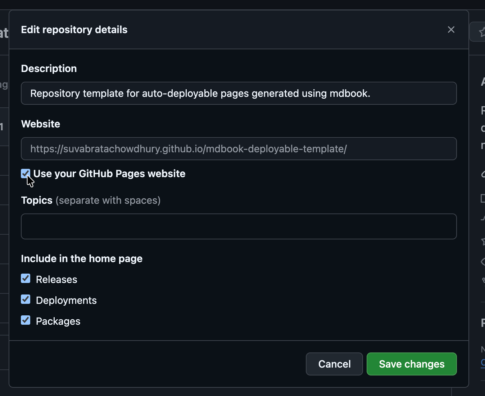

# Setup
To start writing and deploying your book‑site, you only need a few configurations. If you can create a GitHub repository, you're good to go.

## Repository setup
1. Create a new repository from [this template](https://github.com/SuvabrataChowdhury/mdbook-deployable-template).
    - **Helpful doc**: [Creating a repository from a template](https://docs.github.com/en/repositories/creating-and-managing-repositories/creating-a-repository-from-a-template).
2. Enable GitHub Pages for the new repository.
    - In your new repo, go to **Settings → Pages**.
    - Set the **publishing source** to **GitHub Actions** (you don't need to touch branches like gh‑pages yourself).
    - **Helpful doc**: [Publishing with a custom GitHub Actions workflow](https://docs.github.com/en/pages/getting-started-with-github-pages/configuring-a-publishing-source-for-your-github-pages-site#publishing-with-a-custom-github-actions-workflow).
3. Optionally, edit the repository description to always have quick access to the deployed page's URL.
    - In your new repo, go to **About → Settings → Tick `Use your GitHub Pages website` → `Save Changes`**



> Once Pages is enabled, the deploy workflow runs automatically on every push to `main`.

## Local environment setup
Regardless of how you initialize your book, you will need the following on your machine.

1. Install the [mdbook](https://rust-lang.github.io/mdBook/guide/installation.html) CLI.
    - On most systems this is just a single command (e.g., via cargo or a platform‑specific package manager).
2. Ensure git is installed. If not, follow this [Installation guide](https://git-scm.com/install/).
3. Clone the repository you created in the [Repository setup](#repository-setup) step:
    ```bash
    git clone https://github.com/YOUR-USERNAME/YOUR-REPO.git
    cd YOUR-REPO
    ```

## Initialize your book
The initialization step sets up your book's title, author, and structure. You can do this either via GitHub Actions or by running the script locally.

### Via GitHub Actions (Recommended)
No local tooling required for this step — works on all platforms including Windows.

1. Enable GitHub Actions to create and approve pull requests.
    - Go to **Settings → Actions → General → Tick `Allow GitHub Actions to create and approve pull requests` → `Save`**
2. Go to **Actions → Init Repository → Run Workflow**, enter your book title and author name, then click **Run Workflow**.
    - A pull request will open once the workflow completes with all the changes needed to initialize your repository.
    - Review and merge the pull request.
    - Pull the latest changes locally and you are all set.

### Via init.sh
> **Windows users**: The `init.sh` script requires a Unix shell. Use the [GitHub Actions approach](#via-github-actions-recommended) above instead, or run the script inside [WSL (Windows Subsystem for Linux)](https://learn.microsoft.com/en-us/windows/wsl/install).

1. Switch to a new branch before making changes:
    ```bash
    git checkout -b init
    ```
    See [Git feature branch workflow](https://www.atlassian.com/git/tutorials/comparing-workflows/feature-branch-workflow) for good practices.
2. Run the `init.sh` script:
    ```bash
    chmod +x init.sh
    ./init.sh
    ```
3. Push the setup changes to your repo:
    ```bash
    git add .
    git commit -m "init"
    git push
    ```
    - If this is the first push, Git may report that the upstream branch is not set. The error message will include the command to set it (e.g., `git push --set-upstream origin init`).
    - If you used a branch other than `main` (for example, `init`), open a pull request against `main` for the setup changes to take effect.
